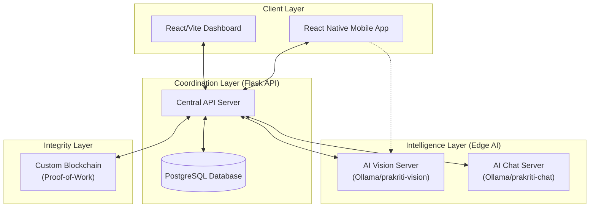

# Prakriti System Architecture

## 1. High-Level Architecture
Prakriti follows a **distributed modular architecture** composed of four distinct layers: Client, Coordination (API), Intelligence (AI), and Integrity (Blockchain).

---

## 2. Component Breakdown

### Client Layer
- **Mobile Application (React Native)**: Handles end-user interactions. Communicates with the Central API for user data and directly with the Vision Server for some real-time classification tasks.
- **Admin Dashboard (React + Vite)**: A specialized data-visualization portal for stakeholders. It fetches aggregated "In-Sights" from the Central API.

### Coordination Layer (Prakriti-Apis)
The Flask-based central hub acts as the **Gateway**.
- **Role**: Validates requests, manages state, and orchestrates calls between the AI, Database, and Blockchain.
- **Persistence**: Uses **SQLAlchemy** to interface with **PostgreSQL**.
- **Modules**: Auth, History, Business, QR Validation, and Task Submission.

### Intelligence Layer (ai-backend)
Decoupled AI services running as independent Flask servers.
- **Vision Server**: Receives image files, utilizes `ollama` with a custom sustainability-weighted model to perform waste classification and litter detection.
- **Chat Server**: Manages multi-turn conversations with `PrakritiK AI`, utilizing in-memory history and the `prakriti-chat` model.

### Integrity Layer (greenPoints-local-Blockchain)
A custom-built blockchain ensuring that GP rewards are decentralised and immutable.
- **Transactions**: Every reward (GP) is a transaction in a block.
- **Consensus**: SHA-256 Proof-of-Work (PoW). A block is valid only when it meets the current system difficulty.
- **Emission**: Only the `SYSTEM` sender can emit new GP coins into circulation upon verified environmental task completion.

---

## 3. Data Flow Architecture

### The Action-Reward Cycle
1. **User Request**: Mobile Client uploads a photo of a "Tree Planting" task.
2. **AI Validation**: Central API routes the image to the **Vision Server**.
3. **Task Completion**: If AI returns `conf > 0.8`, the API marks the task as `COMPLETED`.
4. **Blockchain Commit**:
    - API creates a `task_reward` transaction.
    - The transaction is added to the **Blockchain Pool**.
    - The Background Miner (or periodic mining) seals the block.
5. **Wallet Update**: User's GP balance in the Mobile App reflects the new transaction from the blockchain ledger.

---

## 4. Security Architecture

| Feature | Implementation | Purpose |
| :--- | :--- | :--- |
| **Authentication** | JWT (JSON Web Tokens) | Secure session management between Mobile/API. |
| **Integrity** | SHA-256 Hashing | Ensures blockchain blocks cannot be modified. |
| **Validation** | Proof-of-Work | Prevents spamming blocks/mining rewards. |
| **Storage** | PostgreSQL | Secure relational storage for PII (Personally Identifiable Information). |
| **Inference** | Local Model Hosting | Keeps user data (images/chat) within the local ecosystem (no third-party AI APIs). |

---

## 5. Technology Stack Summary (Detailed)
- **Backend Service**: Flask (Python 3.10+)
- **Database Architecture**: Relational (PostgreSQL) + Decentralized (Custom Blockchain)
- **Frontend Core**: React Native (Expo) & React (Vite)
- **Styles**: Tailwind CSS / Vanilla CSS / Lucide Icons
- **AI Core**: Ollama (prakriti-vision / prakriti-chat)
- **Connectivity**: REST over HTTP (JSON)

---
**Standard Architecture Documentation v1.0**  
*Codeforge Team H | Prakriti Sustainability Project*
