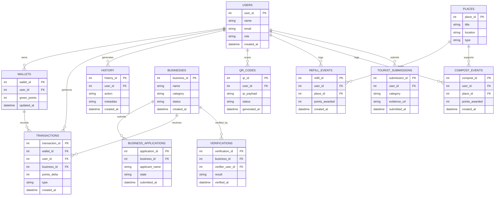

# Entity Relationship Diagram

```mermaid
erDiagram
    USERS ||--o{ WALLETS : owns
    USERS ||--o{ TRANSACTIONS : performs
    USERS ||--o{ HISTORY : generates
    USERS ||--o{ QR_CODES : scans

    BUSINESSES ||--o{ BUSINESS_APPLICATIONS : submits
    BUSINESSES ||--o{ TRANSACTIONS : receives
    BUSINESSES ||--o{ VERIFICATIONS : verified_by

    WALLETS ||--o{ TRANSACTIONS : records

    PLACES ||--o{ REFILL_EVENTS : hosts
    PLACES ||--o{ COMPOST_EVENTS : supports

    USERS ||--o{ REFILL_EVENTS : logs
    USERS ||--o{ COMPOST_EVENTS : logs
    USERS ||--o{ TOURIST_SUBMISSIONS : submits

    USERS {
        int user_id PK
        string name
        string email
        string role
        datetime created_at
    }

    WALLETS {
        int wallet_id PK
        int user_id FK
        int green_points
        datetime updated_at
    }

    TRANSACTIONS {
        int transaction_id PK
        int wallet_id FK
        int user_id FK
        int business_id FK
        int points_delta
        string type
        datetime created_at
    }

    HISTORY {
        int history_id PK
        int user_id FK
        string action
        string metadata
        datetime created_at
    }

    QR_CODES {
        int qr_id PK
        int user_id FK
        string qr_payload
        string status
        datetime generated_at
    }

    BUSINESSES {
        int business_id PK
        string name
        string category
        string status
        datetime created_at
    }

    BUSINESS_APPLICATIONS {
        int application_id PK
        int business_id FK
        string applicant_name
        string state
        datetime submitted_at
    }

    VERIFICATIONS {
        int verification_id PK
        int business_id FK
        int verifier_user_id FK
        string result
        datetime verified_at
    }

    PLACES {
        int place_id PK
        string title
        string location
        string type
    }

    REFILL_EVENTS {
        int refill_id PK
        int user_id FK
        int place_id FK
        int points_awarded
        datetime created_at
    }

    COMPOST_EVENTS {
        int compost_id PK
        int user_id FK
        int place_id FK
        int points_awarded
        datetime created_at
    }

    TOURIST_SUBMISSIONS {
        int submission_id PK
        int user_id FK
        string category
        string evidence_url
        datetime submitted_at
    }
```