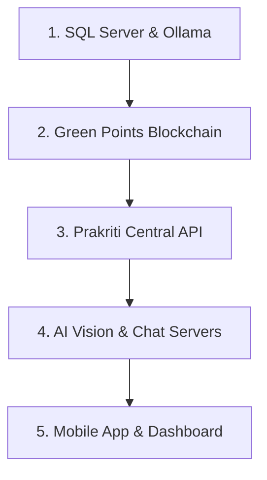

# 🚀 Execution Guide: Prakriti Ecosystem

This guide provides step-by-step instructions to initialize and run the entire **Prakriti** sustainability ecosystem.

---

## 📋 Prerequisites

Before starting the services, ensure you have the following installed:

1.  **Python 3.10+**: For Blockchain, AI Backend, and Central API.
2.  **Node.js & npm**: For the Mobile App (Expo) and Web Dashboard (Vite).
3.  **PostgreSQL 14+**: With a database named `prakriti`.
4.  **Ollama**: For local AI model execution.
    -   Models needed: `prakriti-vision:latest`, `prakriti-chat:latest`.
5.  **psycopg2-binary**: Required for Python database connectivity (installed via pip).

---

## ⚡ Execution Order

To ensure components inter-connect correctly, follow this startup sequence:



---

## 🛠️ Detailed Startup Steps

### 1. External Dependencies
-   **PostgreSQL**: Ensure PostgreSQL is running and create the database:
    ```bash
    # Create the prakriti database
    sudo -u postgres psql -c "CREATE DATABASE prakriti;"
    ```
-   **Configure .env**: Update `Prakriti-Apis/.env` and `greenPoints-local-Blockchain/.env` with your PostgreSQL credentials.
-   **Ollama Models**:
    ```bash
    ollama run prakriti-chat
    ollama run prakriti-vision
    ```

### 2. Green Points Blockchain (PoW Ledger)
Coordinates the decentralized reward system.
```bash
cd greenPoints-local-Blockchain
pip install -r requirements.txt
python3 server.py
```
*Running on: `http://localhost:5000`*

### 3. Prakriti Central API (Backend)
Handles business logic, database operations, and mobile integrations.
```bash
cd Prakriti-Apis
pip install -r requirements.txt
python3 server.py
```
*Running on: `http://localhost:8080`*

### 4. AI Backend (Vision & Chat)
Provides intelligent waste classification and sustainability guidance.
```bash
# Terminal A (Vision)
cd ai-backend
python3 prakriti_ai_vision_server.py

# Terminal B (Chat)
cd ai-backend
python3 prakriti_ai_chat_server.py
```
*Vision on: `http://localhost:8000` | Chat on: `http://localhost:8001`*

### 5. Prakriti Dashboard (Web)
Admin panel for analytics and verification.
```bash
cd Prakriti-Dashboard
npm install
npm run dev
```
*Running on: `http://localhost:5173` (default)*

### 6. Prakriti App (Mobile)
User and Verifier mobile interface.
```bash
cd Prakriti-App
npm install
npx expo start
```
*Scan the QR code with the Expo Go app on your mobile device.*

---

## ✅ Post-Execution Checklist

- [ ] **Verify Blockchain**: Visit `http://localhost:5000/api/stats` to check status.
- [ ] **Verify Central API**: Visit `http://localhost:8080/` (Should see "Prakriti API is running 🚀").
- [ ] **Verify AI Health**: Check `http://localhost:8000/health` and `http://localhost:8001/health`.
- [ ] **Database Connection**: Ensure `.env` files have correct PostgreSQL credentials and run `python3 db.py` to test.

---

> **Note**: For production-like environments, ensure all `.env` files (if present) are configured with correct IP addresses rather than `localhost` if testing across different devices on the same network.
