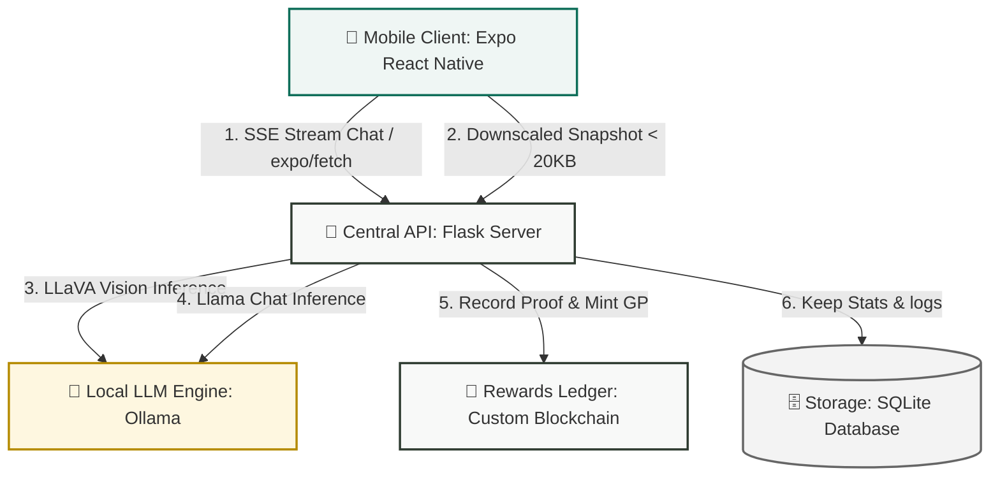

# 🌿 Prakriti: A Blockchain-Powered Sustainability Ecosystem

[]()
[]()
[]()
[]()
[]()

**Prakriti** (Nature) is a decentralized, fully open-source, AI-integrated ecosystem designed to solve the growing environmental challenge in tourist-heavy and geographically sensitive regions. By combining a **Custom Blockchain** for secure reward transactions, **Computer Vision** for waste validation, and **Mobile/Web interfaces**, Prakriti transforms environmental responsibility into a rewarding digital economy.

---

## 🏗️ Architecture Flow



---

## ✨ Core Features

*   **⛓️ Zero-Gas GP Blockchain**: A local, custom secure blockchain ledger for rewarding eco-actions (Green Points - GP) securely with zero transaction overhead.
*   **👁️ Ultra-Fast AI Vision Guard**: Fast waste classification and litter reporting powered by `prakriti-vision` (LLaVA), optimized with **on-device downscaling** to achieve under-2-second end-to-end analysis.
*   **💬 Real-Time Eco-Copilot**: A sustainability-focused chat assistant powered by `prakriti-chat` (Llama), using modern **WinterCG `expo/fetch` streaming APIs** for instant token-by-token Hermes response delivery.
*   **💧 Smart Refill Stations**: QR-based tracking for water and detergent refills to reduce single-use plastic consumption.
*   **📊 Insight Dashboard**: Real-time admin workspace displaying sustainability metrics, litter report heatmaps, and environmental compliance scores.

---

## 🛠️ Project Structure

The project has been organized into clean, modularized components under the **Prakriti** repository:

```bash
Prakriti/
├── prakriti-apis/           # 🐍 Flask central REST API services
│   ├── ai/                  # 🤖 Chat and Vision Ollama blueprint routers
│   ├── uploads/             # 📂 Temporary image upload storage
│   └── api.log              # 📝 Central backend logs
├── prakriti-app/            # 📱 React Native / Expo mobile application
│   ├── src/
│   │   ├── screens/         # 🎨 Screen interfaces (Tourist / Verifier UI)
│   │   └── config.js        # ⚙️ Dynamic client IP configurations
│   └── .env.example         # 📝 Environment template for developers
├── prakriti-dashboard/      # 📊 Vite-powered administrator analytical workspace
└── database/                # 🗄️ SQLite local schema storage
```

---

## 🚀 Speed & UI Redesign Optimizations

Recently, two major architectural enhancements were implemented to provide a high-end, lightning-fast application feel:

### 1. Ultra-Fast AI Vision (Under 2 Seconds)
*   **Problem**: Mobile camera captures are typically 3-5MB. Uploading these payloads and feeding them into local LLaVA models on edge servers took over 12 seconds per analysis.
*   **Solution**: Added on-device compression (`width: 384`, `compress: 0.65`) before uploading. The compressed payload is **under 20KB**, which transfers instantly and cuts Ollama's LLaVA patch-evaluation time down to **under 1.5 seconds**.

### 2. Premium Full-Screen Results UI
*   **Problem**: The original bottom-sheet result list felt cramped and like a basic snackbar.
*   **Solution**: Redesigned into a full-screen premium visual board featuring:
    *   **Hero Image Header**: Prominent 35% height hero display of the captured waste item with gradient overlays.
    *   **Glowing Category Badges**: High-contrast, dynamic badges indicating recyclability (Green for recyclable, Red for hazardous, Sage for organic).
    *   **Checklist Steps**: Beautiful card-based layouts with custom verification CTAs to earn GP instantly.
    *   **Eco-Copilot Assist**: Seamlessly bridge vision to chat with a single tap.

---

## 💻 Setup & Installation

### Prerequisite
Ensure [Ollama](https://ollama.com/) is installed and running locally on your server machine.

### 1. Local AI Models Configuration
Create and build the custom models in Ollama:

```bash
# Build the Chat Model
ollama create prakriti-chat -f ./modelfles/chat/Modelfile

# Build the Vision Model
ollama create prakriti-vision -f ./modelfles/vision/Modelfile
```

### 2. Backend API Setup
Configure the Python environment and database:

```bash
cd prakriti-apis
# Create virtual environment
python3 -m venv prakriti-venv
source prakriti-venv/bin/activate

# Install dependencies
pip install -r requirements.txt

# Run server
./run.sh
```

The Flask API will automatically start on port `8080` and log to `api.log`.

### 3. Frontend Mobile App Setup
Configure your environment variables and start the Expo client:

```bash
cd prakriti-app

# 1. Create your local .env configuration file
cp .env.example .env

# 2. Open .env and replace http://localhost with your server machine's actual LAN IP
# Example: EXPO_PUBLIC_SERVER_IP=http://192.168.1.104
# (This allows physical mobile devices on the same WiFi network to communicate with the API)

# 3. Install packages & start the Expo bundler
npm install
npm start
```

---

## 🤝 Contributing to Prakriti

As a fully open-source project, we enthusiastically welcome contributions from developers, designers, and environmental advocates!

### How You Can Help
1.  **Fork the Repository** and clone your fork locally.
2.  **Create a Feature Branch** (`git checkout -b feature/amazing-feature`).
3.  **Implement your improvements** (e.g. adding offline support, new smart refill parameters, or translation packages).
4.  **Open a Pull Request** describing your changes clearly.

Please make sure to run linter tests and verify builds on all platform targets before submitting.

---

## 📄 License

Prakriti is licensed under the **MIT License** — feel free to use, modify, and distribute the software as part of your region's environmental initiatives. See the `LICENSE` file for more details.

---

## 👥 Contributors

**Prakriti Team**  
*Advancing the frontier of Green Technology.*

---
> "Nature does not hurry, yet everything is accomplished." — **Prakriti** helps us keep it that way. 🌲
